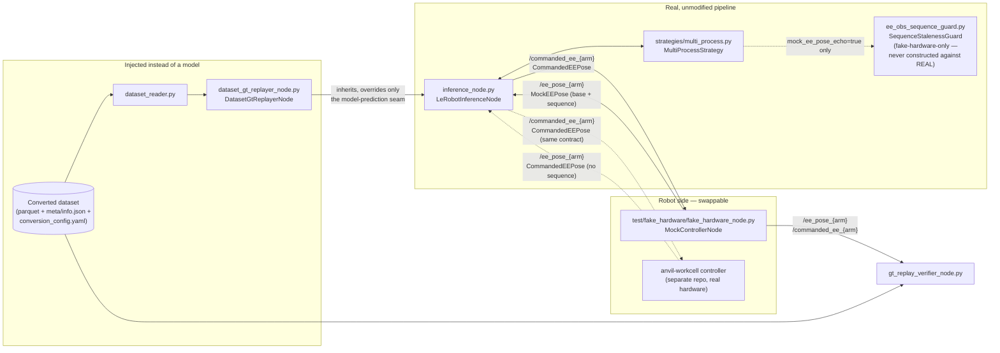

# Dataset GT-Replayer & Fake-Hardware Architecture

**Status: describes the system as actually implemented** (as opposed to
`claude_docs/gt-replay/2026-07-17-dataset-gt-replayer-plan.md` and `claude_docs/gt-replay/2026-07-18-correctness-test-plan.md`, which are the
historical design proposals that preceded this build). Read those for *why* certain
decisions were made; read this for *what exists now, how it fits together, and how to use
it*.

## 1. What problem this solves

`mcap_converter` turns raw recording sessions into LeRobot-format training datasets. The
question this whole subsystem answers: **does replaying a converted dataset's own recorded
`action` values through the real inference pipeline reproduce what was actually recorded?**

If the answer is no, either the converter encoded something wrong (a bad `action_encoding`
choice, a sign/axis bug, a units mismatch) or `inference_node.py`'s consumption of that
encoding (the restore math, the publish loop) doesn't match what the converter assumed —
and either way, that's a bug worth catching **before** spending GPU time training a model on
bad data.

The mechanism: instead of building a separate math-only checker (the old, now-deleted
`anvil_eval/gt_replay.py`), a recorded episode's `action` rows are injected **directly into
the real `LeRobotInferenceNode` pipeline**, at the exact seam where a model's prediction
normally appears. Every other line of the pipeline — observation reading, the action deque,
the decoupled delta-mode publish loop, absolute restoration, message construction, and
publishing — runs completely unmodified. This validates the converter's output and the
pipeline's consumption of it in one shot, against production code, not a reimplementation of
it.

## 2. The actors



| Actor | File | Role |
|---|---|---|
| `DatasetGtReplayerNode` | `dataset_gt_replayer_node.py` | Subclasses `LeRobotInferenceNode`; the *only* thing it changes is "what does the model predict this tick" — it returns the next recorded `action` row instead |
| `LeRobotInferenceNode` | `inference_node.py` | The real, production inference loop: reads observations, runs the model (or, here, the replayer's override), composes/restores actions, publishes commands |
| `MultiProcessStrategy` | `strategies/multi_process.py` | Observation acquisition — camera frames via shared-memory worker processes, plus either EE pose or joint state |
| `SequenceStalenessGuard` | `ee_obs_sequence_guard.py` | Pure-logic staleness detector for the mock's `/ee_pose_{arm}` echo — **fake-hardware-only**, gated by the `mock_ee_pose_echo` param (§7); real hardware never constructs one |
| `MockControllerNode` | `test/fake_hardware/fake_hardware_node.py` | Simulates the robot controller for integration testing — no real robot needed |
| Real robot controller | *not in this repo* (`anvil-workcell`) | Drives actual hardware; publishes/subscribes the same `CommandedEEPose` contract as the mock's `base` fields, unmodified (§9) |
| `GtReplayVerifierNode` | `gt_replay_verifier_node.py` | Automated correctness check: compares the live published trajectory against the dataset's own recorded trajectory |

## 3. The wire contract: `CommandedEEPose.msg` and `MockEEPose.msg`

`/commanded_ee_{arm}` (inference node's outgoing commands, both directions of the pipeline)
and real hardware's `/ee_pose_{arm}` always use the plain, unmodified
`anvil_msgs/CommandedEEPose` (`ros2/src/anvil_msgs/msg/CommandedEEPose.msg`):

```
std_msgs/Header header
geometry_msgs/Pose pose      # position (m) + orientation (quaternion, xyzw)
float64 gripper              # target/observed gripper opening (m)
```

This is byte-identical to `anvil-workcell`'s own vendored copy of the same message, and stays
that way deliberately — `CommandedEEPose` is the one type both repos' wire contracts must
agree on, and it carries no fake-hardware-specific concerns.

The mock's `/ee_pose_{arm}` echo, and only that topic, publishes a distinct composed type,
`anvil_msgs/MockEEPose` (`ros2/src/anvil_msgs/msg/MockEEPose.msg`):

```
CommandedEEPose base         # identical pos/quat/gripper payload
uint64 sequence              # monotonic counter — see §7/§8, mock-only
```

An earlier version of this design added `sequence` directly onto the shared
`CommandedEEPose.msg` and synced that schema to `anvil-workcell`. That coupled two
repositories' wire contracts to fix a bug that only the mock's echo can have (§7) — reverted;
see §15 for why. `sequence` now lives exclusively in `MockEEPose`, a **fake-hardware-only**
type published only by `test/fake_hardware/fake_hardware_node.py` and subscribed only by code
that explicitly knows it's talking to the mock (`strategies/multi_process.py`'s
`mock_ee_pose_echo` gate, `gt_replay_verifier_node.py`). It is a plain
monotonically-incrementing counter, not derived from `header.stamp` — wall-clock timestamps
can be non-monotonic across clock corrections, NTP sync, or cross-thread jitter, and only
answer "when did this happen," not "is this strictly newer than the last message I consumed."

Other topics in play:
- `/cam_waist`, `/cam_wrist_r`, `/cam_chest`, `/cam_wrist_l` `.../image_raw/compressed` — camera frames (`sensor_msgs/CompressedImage`), same in both EE and joint mode.
- Joint mode only (legacy, non-EE checkpoints): `/joint_states` (`sensor_msgs/JointState`, robot → node) and `/follower_{l,r}_forward_position_controller/commands` (`std_msgs/Float64MultiArray`, node → robot).

## 4. The dataset side: `dataset_reader.py`

Shared, **zero-`rclpy`-dependency** module — the home for reading anything out of a
converted LeRobot-format dataset (actions, observations, metadata). It's rclpy-free
deliberately: this lets plain Python scripts (like the test driver, §11) import it directly
via `sys.path` injection without needing a ROS environment, and it's what
`dataset_gt_replayer_node.py` and `gt_replay_verifier_node.py` both build on so neither
reimplements parquet-globbing/column-extraction logic.

| Function | Purpose |
|---|---|
| `load_info(dataset_root)` | Raw `meta/info.json` dict |
| `resolve_action_type(dataset_root, logger=None)` | `joint_abs` / `ee_abs` / `ee_delta`, from `conversion_config.yaml`'s `data_space`/`action_encoding` |
| `resolve_observation_encoding(dataset_root, logger=None)` | `quaternion` or `rot6d` — which layout `observation.state` is stored in |
| `load_episode_columns(dataset_root, episode_idx, columns)` | Generic parquet read for one episode, arbitrary column list |
| `load_episode_actions(dataset_root, episode_idx)` | The `action` column as a `(T, action_dim)` array, native on-disk encoding, **not restored/converted** |
| `load_episode_observations_quat(dataset_root, episode_idx)` | The full `observation.state` trajectory, always converted to quaternion layout (passthrough if already quat, `ee_rot6d_to_quat_layout` if rot6d) |

Encoding detection deliberately uses a raw, lenient `yaml.safe_load` — **not**
`mcap_converter.config.loader.ConfigLoader` — because the inference Docker image doesn't
ship `mcap_converter` (it's the wrong dependency direction: the converter is the upstream
producer, inference is a downstream consumer). This is a hard constraint, not a style
choice: every dataset this tool targets is already on the current schema, so there's no
migration-aware parsing to lose by skipping `ConfigLoader`.

No image/video reading — parquet doesn't hold image bytes (those live in `videos/*.mp4` and
need `LeRobotDataset`'s video decode, a materially different kind of reader). Neither the
replayer nor the verifier touches images, so this is an explicit non-goal, not a gap.

## 5. `DatasetGtReplayerNode` — the seam injection

`dataset_gt_replayer_node.py`'s `DatasetGtReplayerNode` subclasses `LeRobotInferenceNode` and
overrides exactly the methods needed to swap "a loaded model" for "a loaded episode's
recorded actions":

| Overridden method | What it does instead of the base class |
|---|---|
| `_setup_config` | Declares `dataset`, `episode`, `loop`, `hold_last`, `dry_run` params (instead of `model_path`) before calling `super()._setup_config()` |
| `_validate_required_params` | Requires `dataset` (a directory) instead of `model_path` |
| `_load_run_metadata` | Derives `image_shape`/`obs_state_dim`/`action_type` from `meta/info.json` + `dataset_reader.resolve_action_type`, instead of a checkpoint's `config.json` |
| `_resolve_action_type` | Delegates to `dataset_reader.resolve_action_type` |
| `_setup_model` | No model to load — loads the target episode's raw `action` rows via `dataset_reader.load_episode_actions` into `self._gt_actions`, resets `self._replay_cursor = 0` |
| `_load_episode_actions` | Thin wrapper around `dataset_reader.load_episode_actions` |
| `_produce_action(observation, ee_obs_window_rel)` | **The seam.** Returns the next recorded row (`self._gt_actions[self._replay_cursor]`, cast to `float32`) instead of running a model forward pass |

`_produce_action`'s exact behavior (this is the part worth reading carefully):

```python
def _produce_action(self, observation, ee_obs_window_rel):
    if len(self._classic_action_deque) >= self._classic_action_deque.maxlen - 1:
        return None                          # backpressure: never drop a row
    if self._replay_cursor >= len(self._gt_actions):
        ... handle loop / hold_last / shutdown ...
        return None
    action = self._gt_actions[self._replay_cursor].astype(np.float32)
    if self.dry_run:
        ... log only, still advance cursor, return None ...
    self._replay_cursor += 1
    return action
```

Two things matter here:
- **Backpressure, not silent dropping.** A replayed row can't be regenerated the way a model
  prediction can — if the base class's `_classic_action_deque` (`maxlen=10`) were allowed to
  overflow, `deque`'s own eviction would silently discard the oldest queued row. The explicit
  `maxlen - 1` check means `_produce_action` simply produces nothing that tick instead,
  and the row is read again next tick — nothing is ever lost.
- **Everything after this call is the same code a real model would drive.** The returned
  action is appended to `_classic_action_deque` by `_obs_update` (inherited, unchanged); the
  decoupled `_publish_loop` (inherited, unchanged) pops it, composes/restores it if
  `ee_delta`, and publishes it exactly as it would for live inference.

`main()` mirrors `inference_node.main()`'s explicit `SIGTERM` handling (Docker sends
`SIGTERM` on stop; the default Python action skips `destroy_node()`/cleanup).

## 6. `LeRobotInferenceNode`'s core loop (inherited unmodified)

This is the pipeline the replayer rides on top of — understanding it is understanding what
the replayer is actually testing.

### Split-timer architecture
Two independent ROS2 timers, each on its own `MutuallyExclusiveCallbackGroup`, both firing at
`control_frequency` Hz:

- **`_obs_timer` → `_obs_update`**: reads the current observation (`self.strategy.get_observation(...)`),
  runs any needed EE encoding conversion, and — for classic (ACT/Diffusion) models —
  produces an action (via `_produce_action`, real model or replayer override) and appends it
  to `_classic_action_deque`.
- **`_publish_timer` → `_publish_loop`**: pops the next queued action and publishes it.

This split exists so VLA models' background async inference thread and classic models'
synchronous-in-`_obs_update` inference share one publish-side implementation.

### The `ee_delta` decoupled compose (`_publish_loop`)
For `ee_delta` action types, the deque holds **deltas**, not pre-restored absolutes.
`_publish_loop` composes `absolute_target = obs_pose ∘ delta` **fresh, at every publish
tick**, against whatever the freshest observed pose is *at that instant* — not the pose from
whenever the chunk/delta was originally predicted. This is what makes open-loop chunk
execution safe without forward-integration drift (see `claude_docs/ee-delta/2026-07-17-flow-plan.md`,
Item 2). The freshest-observed-pose value lives in `self._ee_delta_latest_obs_quat`,
refreshed every `_obs_update` tick, read under `self._obs_lock` by `_publish_loop`.

### The 1-frame-lookahead identity
This is the mathematical fact the whole correctness test (§10) is built on:
`published_cmd[t] (quat) == dataset.observation.state[t+1] (converted to quat)` — for
**both** `ee_abs` and `ee_delta`. For `ee_delta` this falls out of how the converter defines
`action[t] = ee_delta_forward(pose[t+1], anchor=pose[t])` and `ee_delta_restore_step` being
its exact algebraic inverse; for `ee_abs` it's near-tautological (the action *is* a rot6d
re-encoding of `observation.state[t+1]`). One assertion formula covers both encodings.

## 7. Observation acquisition & the mock's sequence-staleness fix (`MultiProcessStrategy`)

`strategies/multi_process.py`'s `MultiProcessStrategy` is what `_obs_update` actually calls
into for `get_observation()`. In EE mode (detected by the presence of `ee_command_topic` in
the config's `arms:` block — **not** by any launch flag), it:

1. Subscribes to each arm's `ee_obs_topic` (default `/ee_pose_{arm}`) — message type and
   callback chosen by the `mock_ee_pose_echo` ROS param (declared in `inference_node.py`,
   threaded into `MultiProcessStrategy.setup()`, defaults `false`): `MockEEPose` +
   `_make_mock_ee_cb` when `true` (talking to the mock), plain `CommandedEEPose` +
   `_make_real_ee_cb` when `false` (talking to real hardware). This is a deployment-level
   choice (set by the compose file that launches against the mock), not a per-model config
   value.
2. On each message, the callback either accepts it into `self._ee_state_by_arm[arm]` (a flat
   `[x,y,z,qx,qy,qz,qw,gripper]` list — single-slot "keep only latest" storage, not a queue)
   or, for the mock-only callback, rejects it as stale.
3. `_build_observation` concatenates all arms' entries (in `_ee_arm_order`) into
   `observation.state`.

**Real hardware's callback (`_make_real_ee_cb`) is unconditional** — every message
overwrites `_ee_state_by_arm[arm]` directly, no staleness check at all. Real hardware never
constructs a `SequenceStalenessGuard` (`self._ee_seq_guard` stays `None`), and
`get_ee_obs_sequence_snapshot()` returns `None` in that case — which makes
`inference_node.py`'s hold-gate below (item 2) a complete no-op for real hardware without
that file needing to know the guard machinery exists at all. See §9 for why this is safe,
not a protection gap.

### The bug this session found and fixed
The mock's echo (§8) can, in rare cases, re-publish a not-yet-updated pose before it has
processed the corresponding command — a genuinely fresh ROS message, but stale *content*.
Investigation (documented in `claude_docs/gt-replay/2026-07-18-correctness-test-plan.md`'s trail) proved via
direct instrumentation that:
- The obs/publish timer handoff itself was never stale (generation counters always
  strictly advanced, 1:1).
- The compose math (`ee_delta_restore_step`) was correct to machine precision when given the
  *correct* anchor.
- The actual anchor **value** occasionally failed to advance for one tick, and once it
  didn't, nothing detected it — the pipeline just composed a fresh delta against a stale
  anchor, permanently shifting the trajectory by one recorded row for the rest of the
  episode (compounding, since the closed loop has no independent ground truth to
  self-correct against).

**Fix, in two parts:**

1. **`SequenceStalenessGuard`** (`ee_obs_sequence_guard.py`, zero-ROS-dependency, unit
   tested, **fake-hardware-only** — see its module docstring) — tracks the last-*accepted*
   `sequence` per arm. A read is stale iff its sequence does not strictly exceed the last
   accepted one. Critically, staleness is judged **purely on sequence non-advancement, never
   on the pose value** — a genuinely stationary arm still advances its sequence every publish
   (the mock bumps it once per *processed command*, not per publish tick — see §8), so "value
   unchanged" and "value stale" are never confused. `multi_process.py`'s `_make_mock_ee_cb`
   calls `guard.check(arm, msg.sequence)` (unwrapping `MockEEPose.sequence`); on a stale read
   it logs a `WARN` (with expected-vs-received sequence) and **does not overwrite**
   `_ee_state_by_arm[arm]`, so the previous known-good value persists. A configurable
   consecutive-stale threshold (`ee_obs_stale_threshold`, default 10) escalates to an `ERROR`
   log once per degradation episode (`is_fault()`) — a genuinely degraded feed gets reported,
   not silently tolerated forever. This whole path only runs when `mock_ee_pose_echo` is true;
   real hardware's `_make_real_ee_cb` never touches a guard instance at all.

2. **Holding the publish tick, not just guarding the read** (`inference_node.py`'s
   `_publish_loop`). Guarding the *write* into `_ee_state_by_arm` alone isn't sufficient:
   `_obs_update` still runs every tick regardless, and would happily capture whatever
   (possibly several-ticks-old) value is currently cached as if it were fresh. The real fix
   is in `_publish_loop`: alongside `_ee_delta_latest_obs_quat`, `_obs_update` also captures
   `_ee_delta_latest_obs_seq` (a per-arm sequence snapshot, via
   `MultiProcessStrategy.get_ee_obs_sequence_snapshot()`). `_publish_loop` compares this
   against `_ee_delta_last_published_seq` (the snapshot from the *last tick it actually
   composed against*); if **any** arm's sequence hasn't strictly advanced, it **holds** —
   does not pop the queued delta, does not publish, logs a `WARN`, and retries next tick.
   This preserves the exact 1:1 obs/delta pairing the recorded trajectory assumes; the
   existing deque backpressure (§5) already handles the resulting queue buildup correctly
   with no further changes needed.

3. **A concurrency fix found along the way**: the EE subscriptions run on a
   `ReentrantCallbackGroup` (shared with a 4-thread `MultiThreadedExecutor`), so the mock
   callback (`_make_mock_ee_cb`'s inner `_cb`) can execute concurrently across threads. The
   guard's check-then-write wasn't atomic, so two overlapping calls could race and let an
   older message's write land after a newer one's. Fixed with a `threading.Lock()`
   (`self._ee_state_lock`) wrapping the check+write — shared by both `_make_mock_ee_cb` and
   `_make_real_ee_cb`, since the lock protects `_ee_state_by_arm` regardless of which callback
   is active.

4. **A warm-up grace period, found and fixed via live docker verification of the
   `MockEEPose` split**: `SequenceStalenessGuard`'s `degraded_after_streak` (default 50)
   was reached — and the guard permanently gave up, disabling the hold-gate entirely — well
   before `dataset_gt_replayer_node`'s container finished starting up (image-worker spawn,
   DDS discovery, etc. realistically take several seconds; the mock's `ee_pose_fps=100Hz`
   idle echo accumulates 50+ "stale" reads of its un-echoed initial sequence value in under
   a second). Once degraded, the guard never re-arms — so it gave up before the episode even
   began, providing **zero** staleness protection for the entire run, reproducing almost
   exactly the original stale-anchor bug this whole mechanism exists to prevent (observed:
   divergence up to 0.18m/38° over an episode). Fixed in `ee_obs_sequence_guard.py`: an arm
   that has never yet genuinely advanced past its first-ever reading is now exempt from
   staleness/degradation tracking entirely (every such read is accepted unconditionally and
   doesn't count toward anything) — indistinguishable from "hasn't started yet," which must
   not be penalized. Only a peer that HAS advanced at least once and THEN gets stuck is
   treated as a real fault. Verified live: after the fix, no premature "giving up" occurred in
   several docker runs, and the previously-observed 0.18m-scale divergence did not recur.

**Known residual limitation**: even with the sequence-guard fix, the concurrency fix, and the
warm-up-grace-period fix above, the fake-hardware closed-loop correctness test (§10) still
fails intermittently, with *both* arms consistently diverging at the identical tick each time
— strongly suggestive of a shared/global timing hiccup (possibly DDS-discovery-related, right
after the `replay` container's own endpoints come up) rather than the per-message race or the
degradation-timing bug, both already fixed. The originally-documented rate was roughly 1 in
5–8 runs; live re-verification after the warm-up-grace-period fix (2026-07-20) showed a higher
rate (3/3 runs) in this environment, with divergence magnitudes ranging ~5mm–60mm (much smaller
than the now-fixed 0.18m unbounded-degradation failure, but still outside
`GtReplayVerifierNode`'s tight tolerance). Not root-caused; flagged as the same open follow-up
as before, now with updated evidence — next step if picked back up: capture a `DEBUG=true`
trace of an actual failure and look at what's different structurally about the tick where both
arms diverge simultaneously.
This is a documented open follow-up, not something papered over.

## 8. `MockControllerNode` — the fake-hardware simulator

`test/fake_hardware/fake_hardware_node.py`. Simulates the robot controller for integration
testing with **no real robot needed**. Two modes, mutually exclusive (mirrors production):

### Joint mode (default, `ee_mode:=false`)
Publishes dummy `JointState` at 500Hz (matches real robot rate) on `/joint_states`,
publishes dummy camera frames, and subscribes to
`/follower_{l,r}_forward_position_controller/commands`, validating each received command is
finite. Exits 0 after `required_actions` valid commands, exits 1 on `timeout` or an invalid
(non-finite) value.

### EE mode (`ee_mode:=true`) — the closed-loop echo
This is what the GT-replay correctness test actually exercises. Per arm, the mock keeps
`self._ee_state[arm] = {"pos": ..., "quat": ..., "gripper": ...}`:

- **Seeding** (`_parse_ee_seed_pose`, `_setup_ee_mode`): the `ee_seed_pose` ROS param
  (comma-separated flat floats, `8 * n_arms` values in `ee_arms` order, quat layout) seeds
  the initial state instead of the hardcoded default (`[0.4, 0, 0.5]`, identity quaternion,
  `0.02` gripper). Empty or malformed input silently falls back to the default — a bad seed
  string must never crash the mock. This is what lets the correctness test start the mock
  from the dataset's own first recorded observation row rather than an arbitrary pose.
- **The echo** (`_ee_command_callback`): on receiving a `CommandedEEPose` on
  `/commanded_ee_{arm}`, copies its pos/quat/gripper straight into `self._ee_state[arm]` —
  a perfect, instantaneous echo (no dynamics, no latency, deliberately — this validates
  *software timing and composition correctness*, never physical actuation behavior; it is
  explicitly not a substitute for real-hardware validation). It also bumps
  `self._ee_seq_by_arm[arm] += 1` **here**, not in the publish timer — incrementing once per
  actually-processed command is what makes the sequence field meaningful (a stationary arm
  still advances it every tick since a new, if numerically similar, command keeps arriving;
  a genuinely-not-yet-processed command does not).
- **The publish** (`publish_ee_poses`, on a `1/ee_pose_fps` Hz timer, default 100Hz):
  publishes each arm's *current* state (whatever it is right now — freshly echoed or not) on
  `/ee_pose_{arm}` as a `MockEEPose` — a `CommandedEEPose base` (the same pos/quat/gripper
  payload real hardware would carry) plus `sequence`, set to whatever
  `self._ee_seq_by_arm[arm]` currently holds. It does **not** increment the counter itself.
  `MockEEPose` only exists on this topic, from this node — see §3 for why it's a distinct type
  rather than an added field on the shared `CommandedEEPose`.

Same exit-code contract as joint mode (`_record_valid_action`, shared).

Explicitly out of scope (unchanged from before this session): real actuation dynamics,
physical velocity/latency limits, sensor latency.

## 9. The real-hardware contract (`anvil-workcell`, not in this repo)

`inference_ee.yaml`'s header documents the prerequisite explicitly: *"`/ee_pose_left`,
`/ee_pose_right` must be published by the robot stack; `/commanded_ee_left`,
`/commanded_ee_right` must be subscribed by the IK controller."* The real controller is a
separate repository and is **completely unmodified by this subsystem** — it needs only:

- Publish `CommandedEEPose` (the plain 3-field message, §3 — byte-identical to this repo's
  copy) on `/ee_pose_{arm}`, reflecting the **true, physically measured** end-effector pose
  (not an echo — a real robot's pose advances due to actual motion, independent of round-trip
  timing).
- Subscribe `CommandedEEPose` on `/commanded_ee_{arm}` and drive the IK controller from it.

That's the entire contract. There is no `sequence` field to populate and no
`SequenceStalenessGuard` to satisfy — `mock_ee_pose_echo` defaults `false`, so
`MultiProcessStrategy` uses `_make_real_ee_cb` (§7), which never constructs a guard instance
and accepts every message unconditionally, exactly like the pipeline behaved before any of
this session's sequence-guard work existed.

**Why this is not a reintroduced protection gap.** The bug `SequenceStalenessGuard` fixes
(§7/§8) is specifically that the mock's echo — a pure-software reflection of the last
processed command, with no independent physical sensor driving it — can occasionally
re-publish a not-yet-updated pose before it has processed the corresponding command. A real
robot's `/ee_pose_{arm}` is not an echo at all: it's driven by independent physical sensors
(encoders, FK from `/joint_states`) on their own measurement loop, and structurally cannot
"forget to advance" the way a software echo can. There is no equivalent failure mode on real
hardware for this guard to catch. Removing the guard from the real-hardware path therefore
removes a dormant, never-functional no-op — real hardware never had a working staleness
signal to begin with (an earlier version of this design synced the `sequence` field to
`anvil-workcell`'s schema but never implemented populating it there, §15), and it never needed
one for this specific failure mode. A future reader should not read real hardware's lack of
`SequenceStalenessGuard` as "this path lacks staleness protection" — it lacks a mechanism
for a bug class it cannot experience.

This does **not** mean real hardware's EE-delta anchor tracking is unguarded against every
possible fault (e.g. a genuinely stuck/dead `/ee_pose_{arm}` publisher, or a lossy DDS link)
— those are generic liveness/connectivity concerns, out of scope for this mechanism on either
side, and unrelated to the specific echo-skip bug `sequence` was built to catch.

## 10. `GtReplayVerifierNode` — automated correctness checking

**Scope: fake-hardware-only, full stop.** This node's tight tolerances (`atol_pos_m=1e-4`,
`atol_rot_deg=0.5`) assume the mock's perfect, instantaneous, dynamics-free echo — nothing
about it makes sense against real hardware, and nothing in its design ever assumed real
hardware use (it's only ever wired into `docker-compose.fake-hardware.yml`'s `replay-verify`
profile). A real robot's physically-measured pose will legitimately deviate from the recorded
trajectory (actuation dynamics, control-loop tracking error, physical latency) — that
deviation is expected, not a bug this node should ever flag. Real-hardware evaluation uses a
completely different tool, driven by human judgment rather than a numeric tolerance — see §15.

`gt_replay_verifier_node.py`. A separate node that subscribes to both `/ee_pose_{arm}` (only
to confirm the seed landed — a startup sanity check) and `/commanded_ee_{arm}` (the actual
comparison), and checks the 1-frame-lookahead identity (§6) directly against the dataset's
own recorded trajectory — no live pairing needed, since the expected value at message index
`N` is precomputed as `dataset_reader.load_episode_observations_quat(...)[N+1]`.

Parameters: `dataset`, `episode` (default 0), `arms` (default `left,right`), `atol_pos_m`
(1e-4), `atol_rot_deg` (0.5), `atol_gripper_m` (1e-4), `report_path`, `timeout_sec` (60.0).

Comparison per received command: position error (L2 norm), rotation error (sign-invariant
quaternion angle: `2·arccos(clip(|dot(q1,q2)|, 0, 1))`), and **raw, unscaled** gripper error
— deliberately bypassing `gripper_factor` (a live-inference feel tuning knob, orthogonal to
converter/pipeline correctness) via a dedicated test config,
`configs/lerobot_control/inference_ee_gt_replay_test.yaml` (a copy of `inference_ee.yaml`
with `gripper_factor: 1.0` and wide-open `gripper_min`/`gripper_max` per arm — not for
production use).

Writes a JSON report on completion (or timeout):
```json
{
  "all_passed": true,
  "timed_out": false,
  "action_type": "ee_delta",
  "arms": {
    "left": {
      "n_compared": 592, "n_expected": 592, "n_failed": 0,
      "max_pos_err_m": 3.96e-07, "max_rot_err_deg": 5.03e-05,
      "max_gripper_err_m": 0.0, "seed_confirmed": true,
      "first_failures": []
    },
    "right": { "...": "..." }
  }
}
```

## 11. The driver: `tests/smoke/scripts/gt_replay_correctness_test.py`

Orchestrates the whole thing end-to-end for two fixture datasets
(`data/debug/ee-abs/ee-space-testing`, `data/debug/ee-delta/ee-space-testing`), in **explicit
staged bring-up** rather than one `docker compose up`:

1. Compute the seed string from the dataset's own row 0 (`dataset_reader`, plain Python — no
   ROS needed for this step).
2. `docker compose ... up -d mock-robot`, wait for its healthcheck.
3. `docker compose ... up -d gt-replay-verify`, then sleep `DDS_DISCOVERY_SLEEP_SEC` (3s).
4. `docker compose ... up -d replay`.
5. Poll the mounted report file, assert `all_passed`; dump docker logs on failure/timeout.
6. `docker compose ... down` in `finally`.

The staging matters: the verifier must already be subscribed *before* `replay` starts
publishing — compose's `depends_on` only gates start order, not "has finished subscribing,"
so this can't be expressed declaratively in the compose file alone.

```bash
uv run python tests/smoke/scripts/gt_replay_correctness_test.py
uv run python tests/smoke/scripts/gt_replay_correctness_test.py --timeout-sec 120
uv run python tests/smoke/scripts/gt_replay_correctness_test.py --no-build   # reuse existing image
```

## 12. Docker Compose profiles (`docker-compose.fake-hardware.yml`)

| Profile | Services | Purpose |
|---|---|---|
| `monitor` | `mock-robot`, `monitor` | FPS/connectivity check only, no GPU |
| `inference` | `mock-robot`, `inference` | Full pipeline with a real model, GPU |
| `replay` | `mock-robot`, `replay` | Manual GT-replay against the mock, no model, CPU-only |
| `replay-verify` | `mock-robot`, `replay`, `gt-replay-verify` | Automated correctness check (§10/§11) — bring up in explicit stages, not all at once |

Key env vars for `replay`/`replay-verify`: `EE_MODE`, `DATASET_PATH`, `CONFIG_FILE`,
`EPISODE`, `LOOP`, `HOLD_LAST`, `DRY_RUN`, `EE_SEED_POSE` (replay-verify only, computed by
the driver), `EE_ARMS`, `EE_POSE_FPS`, `CONTROL_FREQ`, `REPORTS_DIR`, `VERIFY_TIMEOUT_SEC`,
`COMPLETION_SIGNAL_DIR`, `HOME_BEFORE_REPLAY` (default `false` here — see §14),
`HOME_ATOL_POS_M`/`HOME_ATOL_ROT_DEG`/`HOMING_TIMEOUT_SEC`. Full descriptions are in the
compose file's header comment.

`docker-compose.yml` (production/real-hardware) additionally has a `gt-replay-real`
service/profile — same shape as `replay` but with real networking (`network_mode: host`,
`privileged: true`) and `HOME_BEFORE_REPLAY` defaulting `true`. Never run directly — see §14.

## 13. How to use this — practical runbook

### A. Automated correctness check (recommended default)
```bash
uv run python tests/smoke/scripts/gt_replay_correctness_test.py
```
Runs both `ee_abs` and `ee_delta` fixtures against the mock, asserts the published trajectory
matches the dataset's own recorded trajectory to tight tolerance. This is what you run after
touching `mcap_converter`'s EE encoding, `ee_runtime.py`'s restore math, or
`inference_node.py`'s publish loop.

### B. Manual GT-replay against fake hardware (no correctness assertion, just watch it run)
```bash
EE_MODE=true DATASET_PATH=$(pwd)/data/debug/ee-delta/ee-space-testing \
CONFIG_FILE=./configs/lerobot_control/inference_ee.yaml \
docker compose -f docker-compose.fake-hardware.yml --profile replay up --build
```
Useful for eyeballing `ros2 topic echo /commanded_ee_left` / `ros2 topic hz` output, or
debugging with `DEBUG=true` (enables the `[DEBUG-ANCHOR]` instrumentation in
`inference_node.py`/`multi_process.py`).

### C. Real inference (unchanged — this session didn't touch this path except the message field)
```bash
EE_MODE=true CONFIG_FILE=./configs/lerobot_control/inference_ee.yaml \
MODEL_PATH=$(pwd)/model_zoo/ee-space/my-dataset/checkpoints/last \
docker compose -f docker-compose.fake-hardware.yml --profile inference up --build
```
Against real hardware, swap `mock-robot` out of the compose graph entirely — the real
`anvil-workcell` controller stands in its place, subject to the contract in §9.

### D. Config knobs worth knowing about
| Knob | Where | Default | Purpose |
|---|---|---|---|
| `ee_obs_stale_threshold` | inference config YAML (top-level) | 10 | Consecutive stale `/ee_pose_{arm}` reads before an `ERROR`-level fault is logged |
| `gripper_factor`/`gripper_min`/`gripper_max` | inference config YAML, per-arm | 0.9 / -0.003 / 0.05 | Live-inference gripper feel tuning — neutralized in the GT-replay test config, never in production |
| `ee_seed_pose` | mock ROS param / `EE_SEED_POSE` env | `""` (hardcoded default pose) | Seeds the mock's initial EE state; used by the correctness test to seed from the dataset's own row 0 |
| `control_frequency` | launch arg / `CONTROL_FREQ` env | 30.0 | Publish/obs-update tick rate — proven invariant for the (now-fixed) staleness bug's onset tick during investigation |
| `ee_pose_fps` | mock ROS param / `EE_POSE_FPS` env | 100.0 | Mock's own `/ee_pose_{arm}` publish rate |
| `completion_signal_path` | replayer ROS param / `COMPLETION_SIGNAL_DIR` env | `""` (disabled) | Sentinel JSON written on completion/interruption/homing failure — see §14 |
| `home_before_replay` | replayer ROS param / `HOME_BEFORE_REPLAY` env | `true` (node default); `false` for the fake-hardware `replay` service, `true` for `docker-compose.yml`'s `gt-replay-real` | Home to the episode's frame-0 pose before GT playback — see §14 |
| `home_atol_pos_m` / `home_atol_rot_deg` | replayer ROS params | `0.025` / `6.0` | Homing arrival tolerance — a coarser "did we arrive" check, NOT `GtReplayVerifierNode`'s trajectory-match tolerance. Slightly above `anvil_eval`'s real-hardware pass/fail threshold (`0.02m`/`5.0deg`, `metrics.py`) — raised from that exact value after live real-hardware testing showed the controller plateauing at ~0.022m/5.9deg rather than fully closing the gap within a realistic `homing_timeout_sec` |
| `homing_timeout_sec` | replayer ROS param | `30.0` | Give up homing (write `homing_failed`, shut down) after this long |
| `home_max_pos_delta_m` / `home_max_rot_delta_deg` | replayer ROS params | `0.01` / `2.0` | Max homing approach speed per publish tick (m / deg) — see §14's safety-ramp note |
| `ee_obs_degraded_after_streak` | inference config YAML (top-level) | 50 | Fake-hardware-only: consecutive stale reads from the mock before its sequence guard gives up and falls back to always-accept — see §14's degraded-fallback note. Never consulted against real hardware (`mock_ee_pose_echo=false`) |
| `mock_ee_pose_echo` | launch arg / ROS param | `false` | Deployment-set (compose file, not per-model config): `true` iff `/ee_pose_{arm}` is the mock's `MockEEPose` echo (sequence-guarded) rather than real hardware's plain `CommandedEEPose` (no guard) — see §7/§9 |

## 14. Real-hardware evaluation via human judgment — `scripts/gt_replay_human_eval.py`

Per §10's scope note, `GtReplayVerifierNode`'s numeric tolerance check is meaningless on real
hardware. This is the tool that replaces it there: replay one or more episodes and ask a
**human operator** to judge task success per episode, rather than compare against the
recording to machine precision. See `claude_docs/gt-replay/2026-07-18-real-hardware-eval-plan.md` for
the full design; this section summarizes what's built.

**Architecture**: a thin host-side wrapper (no new ROS node) orchestrates one
`docker compose up`/`down` cycle per episode — mirroring `gt_replay_correctness_test.py`'s
pattern, but with a human decision inserted into the loop instead of a report-file assertion.
Two small additions to `dataset_gt_replayer_node.py` make this possible:

- **`completion_signal_path`**: when set, the node writes a small JSON sentinel
  (`{"episode": ..., "homing_status": ..., "status": "complete"|"interrupted"|"homing_failed"}`)
  the moment the episode finishes, is interrupted by `SIGTERM`, or homing fails — written
  exactly once (whichever terminal status is reached first wins, so a `SIGTERM` arriving
  after a normal completion can never overwrite it with a less informative `interrupted`).
  The wrapper polls this file instead of screen-scraping logs.
- **Pre-replay homing** (EE mode only, `home_before_replay`): before GT playback begins, the
  robot is commanded to the episode's frame-0 recorded pose (`_publish_home_target`, reusing
  `_publish_ee_action` — no new message-construction code) and held there until the live
  observation confirms arrival within tolerance (`_check_homing_arrival`, using the shared
  `ee_runtime.pose_arrival_error()` helper also used by `GtReplayVerifierNode`) or
  `homing_timeout_sec` elapses. Implemented as two small early-bypass hooks in the inherited
  `_obs_update`/`_publish_loop` (gated on `getattr(self, "_homing_confirmed", True)`, a no-op
  for every other caller, including live-model `inference_node.py` use) — not a separate node
  and not new functionality in the shared base class, since nothing but the replayer needs it
  today. Off by default against the mock (`ee_seed_pose` already provides an instant, exact
  seed there — homing against it would just be redundant, though it does still work
  correctly if forced on, confirming in ~1 tick since the mock's echo is instantaneous).
- **Homing is rate-limited, not a one-shot jump.** `inference_node.py`'s `action_limiter` (the
  joint-space per-tick delta-limiting safety net) is explicitly not applied in EE mode — with
  no ramp, homing would command the robot straight to the frame-0 target regardless of how
  far its actual current pose is from it. `_publish_home_target` instead calls
  `ee_runtime.ramp_toward_pose()` every tick: clamps the position step to
  `home_max_pos_delta_m` (magnitude-based, direction-preserving) and the orientation step to
  `home_max_rot_delta_deg` (via SLERP, the correct way to take a bounded step along the
  shortest quaternion rotation path), converging toward the target over several ticks.
  Defaults (0.01 m / 2.0° per tick) verified live against the mock: with an unseeded mock
  (~0.1–0.3 m away from a fixture's frame-0 pose), homing now takes several seconds to
  confirm instead of the ~1 tick it took before this ramp existed.

**Scope re-decided mid-session: `sequence` is fake-hardware-only, not a shared-schema
concern.** An earlier version of this design added `sequence` directly onto the shared
`CommandedEEPose.msg` and pushed a matching schema-only change to `anvil-workcell` (branch
`patrick/sync-commanded-ee-sequence`) so the two repos' vendored copies of the message would
stay wire-compatible. On reflection this coupled two repositories' wire contracts to work
around a bug that only the mock's echo can have (§7/§9) — real hardware's pose is physically
driven and structurally cannot exhibit it. That branch was reverted and deleted (confirmed via
`git log`/`git branch -r --contains`: single commit, no dependents, safe to remove outright)
and `anvil-workcell`'s `CommandedEEPose.msg` is back to its exact original 3-field shape.
`sequence` now lives exclusively on `MockEEPose.msg` (§3), a fake-hardware-only type this repo
owns end-to-end — no cross-repo schema coordination needed at all, in either direction.

**`SequenceStalenessGuard`'s graceful degradation** (`ee_obs_sequence_guard.py`) is retained,
but purely as a defensive fallback against a *mock* bug, not a real-controller compatibility
concern — see the module's docstring. A sequence value that never advances is only ever
expected to mean the mock itself has stopped incrementing (a bug in
`fake_hardware_node.py`), since real hardware never runs through this code path at all
(`mock_ee_pose_echo=false` routes it to `_make_real_ee_cb`, §7, which has no guard to
degrade). Left unhandled, a stuck sequence would freeze the observation feed permanently after
the first message — every later message looking identically stale forever. Once an arm's
consecutive-stale streak reaches `ee_obs_degraded_after_streak` (default 50, well above the
existing `ee_obs_stale_threshold`'s early-warning fault at 10), that arm's guard gives up —
sticky for the life of the node — and falls back to accepting every read unconditionally,
restoring pre-guard "keep only latest" behavior for it. Verified live (not just in unit
tests): temporarily patched the mock to stop advancing `sequence`, confirmed the fault fires
at streak 10, the one-time "giving up" fallback fires at streak 50, and — critically — the
observation feed kept tracking real pose values afterward instead of freezing.

**Episode selection**: `dataset_reader.parse_episode_spec(spec, total_episodes)` — 0-based,
comma list + `start:end` ranges (end-exclusive, Python slice convention), no negative indices
or step (matches the only two other episode-spec parsers in the repo,
`mcap_converter.cli.convert.parse_episode_index_spec` and `dataset_viz.parse_episodes_spec` —
ported rather than imported, same reasoning as this module's `ConfigLoader` avoidance).

**Per-episode outcome — three orthogonal fields, never conflated**:
- `homing_status`: `confirmed` / `failed` / `skipped`
- `replay_status`: `completed` / `timed_out` / `crashed` / `not_attempted` (set when homing
  failed — GT playback never starts in that case)
- `operator_verdict`: `pass` / `fail` / `null` (`null` whenever `replay_status != "completed"`
  — an episode that never finished replaying is never treated as an operator "fail")

The operator prompt (foreground, blocking `input()`, mirrors `migrate_config.py`'s
`_confirm()` precedent) only fires when `replay_status == "completed"`; otherwise the wrapper
logs a warning and moves on. `pass_rate` in the final report divides by episodes that
actually completed replay, not the total requested, so timeouts/crashes/homing failures don't
silently make the task look worse than it is.

```bash
# Real hardware
scripts/gt_replay_human_eval.py --target real --dataset /path/to/dataset --episodes 0:5 \
  --config-file configs/lerobot_control/inference_ee.yaml

# Fake-hardware dry run (rehearses the tool's own control flow, not a robot)
scripts/gt_replay_human_eval.py --target fake --dataset data/debug/ee-delta/ee-space-testing \
  --episodes 0:2 --config-file configs/lerobot_control/inference_ee.yaml
```

**A pre-existing bug found and fixed along the way**: `mock-robot`'s command constructed
`-p ee_seed_pose:=${EE_SEED_POSE:-}`, which — when `EE_SEED_POSE` is unset — produces
`-p ee_seed_pose:=` (nothing after `=`), and rclpy's parameter-override parser rejects an
empty value outright, crashing the mock at startup. This was never hit before because every
prior caller (`gt_replay_correctness_test.py`) always computed a real seed value. Fixed with
Compose's own conditional interpolation: `${EE_SEED_POSE:+-p ee_seed_pose:=${EE_SEED_POSE}}`
— the whole token disappears when unset, rather than degrading to an invalid empty one.

## 15. Known limitations / open follow-ups

- **Residual flakiness in the mock-based correctness test** (§7): not fully root-caused.
  Originally observed at roughly 1-in-5-to-8 failure rate after the sequence-guard + hold +
  concurrency-lock fixes; live re-verification after the warm-up-grace-period fix
  (2026-07-20, see §7 item 4) showed a higher rate (3/3 runs) in that environment, with
  divergence magnitudes of roughly 5mm-60mm — evidence still points at a DDS-discovery-timing
  event distinct from the (fixed) per-message race and the (fixed) premature-degradation bug,
  since both arms consistently diverge at the identical tick each time. Next step if picked
  back up: capture a `DEBUG=true` trace of an actual failure and look at what's different
  structurally about the tick where both arms diverge simultaneously.
- **Not a limitation, by design**: real hardware has no `sequence`/`SequenceStalenessGuard`
  equivalent at all, and none is planned — see §9's explicit reasoning for why this is not a
  protection gap (the mock's echo-skip bug structurally cannot occur on a physically-driven
  pose). This bullet exists only to pre-empt the question "shouldn't real hardware have this
  too?" — no, by construction.
- **A directly relevant, already-documented, unfixed safety bug exists in `anvil-workcell`**:
  `TODO_commanded_ee_stale_target.md` (found while investigating the now-reverted
  message-schema sync, §14) — `quest_teleop_controller.py` never clears its stored
  `commanded_ee` target once received, so
  when `/commanded_ee_{arm}` stops being published (e.g. this tool's per-episode
  `docker compose down`), the arm stays *actively servoed* to the last commanded pose
  indefinitely, and a subsequent rehome can cause a sudden jump back to that stale target
  before the home trajectory takes over. This is exactly the kind of teardown this tool does
  between every episode — worth fixing in `anvil-workcell` before real-hardware sessions with
  this tool are routine, not something this repo can fix itself.
- **Cross-package dataset-reader consolidation** was explicitly scoped out of
  `dataset_reader.py`'s creation (Tier B/C/D candidates in `mcap_converter`'s `validate.py`,
  `debug_plot.py`, `anvil_eval_ros/cli.py`) — see
  `project_mcap_converter_config_deferred_work.md`-style memory note for the full audit;
  deliberately deferred, not forgotten.
- **Homing can't be genuinely failure-tested against the mock**: since the mock's echo is
  instantaneous with no physical dynamics, it complies with a homing command almost
  immediately regardless of tolerance — a real homing *failure* (robot never arrives) can
  only be forced against the mock with a deliberately unreachable tolerance (e.g.
  `home_atol_pos_m` negative), which is how the `homing_failed` path was verified this
  session. This is expected and correct (the mock genuinely has nothing that can fail to
  arrive), not a gap to fix.
- **Joint mode is out of scope for homing** — `home_before_replay` is unconditionally
  disabled outside EE mode (`_setup_homing`); a joint-space equivalent would use the same
  phase-gating mechanism with a joint-angle distance metric, not yet designed.
